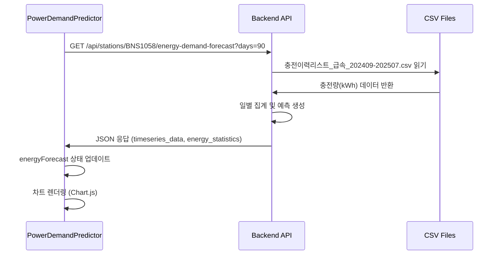

# API 문서 및 데이터 처리 흐름

## 📋 목차
- [API 엔드포인트 개요](#api-엔드포인트-개요)
- [전력량 수요 예측 API](#전력량-수요-예측-api)
- [충전소 목록 API](#충전소-목록-api)
- [데이터 처리 흐름](#데이터-처리-흐름)
- [프론트엔드-백엔드 연동](#프론트엔드-백엔드-연동)

## 🚀 API 엔드포인트 개요

| 엔드포인트 | 메서드 | 설명 | 사용 위치 |
|-----------|--------|------|-----------|
| `/api/stations` | GET | 충전소 목록 조회 | 메인 페이지 |
| `/api/stations/{station_id}/energy-demand-forecast` | GET | 전력량 수요 예측 | PowerDemandPredictor |
| `/api/stations/{station_id}/predictions` | GET | 최고전력 예측 | PeakPowerPredictor |
| `/api/stations/{station_id}/monthly-contract` | GET | 월별 계약전력 | MonthlyChart |

## ⚡ 전력량 수요 예측 API

### 1. API 요청
```javascript
// 프론트엔드 (PowerDemandPredictor.svelte)
const url = `/api/stations/${stationId}/energy-demand-forecast?days=${days}`;
const response = await fetch(url, {
    cache: "no-cache",
    signal: AbortSignal.timeout(15000)
});
```

**요청 파라미터:**
- `station_id`: 충전소 ID (예: BNS1058)
- `days`: 데이터 조회 기간 (30, 90, 180, 365일)

### 2. 백엔드 처리 과정

#### 2.1 API 라우트 처리
```python
# backend/app/api/routes.py
@api_router.get("/stations/{station_id}/energy-demand-forecast")
async def get_energy_demand_forecast(station_id: str, days: int = 90):
    station_service = get_station_service()
    return station_service.get_energy_demand_forecast(station_id, days)
```

#### 2.2 서비스 레이어 처리
```python
# backend/app/services/station_service.py
def get_energy_demand_forecast(self, station_id: str, days: int = 90):
    # 1. 캐시 확인
    cache_key = f"energy_demand_{station_id}_{days}"
    cached_result = self._get_cache(cache_key, use_long_cache=True)
    
    # 2. CSV 데이터 로드
    loader = ChargingDataLoader(station_id)
    df = loader.load_historical_sessions(days=365)  # 1년 데이터로 제한
    
    # 3. 에너지 컬럼 찾기
    energy_cols = [col for col in df.columns 
                   if any(keyword in col.lower() 
                   for keyword in ["에너지", "energy", "kwh", "충전량", "kWh"])]
    
    # 4. 데이터 집계 및 예측
    result = self._generate_energy_forecast(daily_energy, energy_col, station_id)
```

#### 2.3 데이터 로더
```python
# backend/app/data/loader.py
class ChargingDataLoader:
    def load_historical_sessions(self, days: int = 90):
        # CSV 파일에서 데이터 로드
        # 실제 파일: "충전이력리스트_급속_202409-202507.csv"
        # 컬럼: "충전량(kWh)", "충전시작일시", "충전종료일시" 등
```

### 3. API 응답 구조
```json
{
  "success": true,
  "energy_statistics": {
    "total_energy": 33311.39,
    "avg_daily": 594.85,
    "min_daily": 176.02,
    "max_daily": 1057.37,
    "std_daily": 210.13
  },
  "timeseries_data": [
    {
      "date": "2025-06-06",
      "energy": 573.75,
      "type": "actual"
    },
    {
      "date": "2025-08-01",
      "energy": 415.01,
      "type": "predicted"
    }
  ],
  "monthly_summary": [...],
  "growth_rate": 0.0,
  "data_range": {
    "start_date": "2025-06-06",
    "end_date": "2025-07-31"
  },
  "insights": [...],
  "station_id": "BNS1058",
  "station_name": "서울 흑석운수"
}
```

## 🏢 충전소 목록 API

### 1. API 요청
```javascript
// 프론트엔드 (stationStore.ts)
const response = await apiService.getStations({
    limit: 9999,
    search: search,
    sortBy: sortBy,
    sortOrder: sortOrder
});
```

### 2. 백엔드 처리
```python
# backend/app/services/station_service.py
def list_stations(self, search: str = None, sort_by: str = "id", sort_order: str = "asc"):
    # 1. 캐시 확인 (1시간 캐시)
    cache_key = f"stations_{search}_{sort_by}_{sort_order}"
    cached_result = self._get_cache(cache_key, use_long_cache=True)
    
    # 2. CSV 파일에서 전체 데이터 로드
    loader = ChargingDataLoader("ALL")
    df = loader.load_historical_sessions(days=365)
    
    # 3. 충전소별 집계 데이터 생성
    stations = self._process_station_list(df, search, sort_by, sort_order)
```

## 🔄 데이터 처리 흐름

### 1. CSV 데이터 구조
```csv
권역,시군구,충전소ID,충전소명,충전소주소,...,충전량(kWh),순간최고전력
서울특별시,동작구,BNS1058,서울 흑석운수,...,201.17,97.16
```

### 2. 데이터 변환 과정
```python
# 1. CSV 로드 및 필터링
df = pd.read_csv(csv_file)
df_station = df[df['충전소ID'] == station_id]

# 2. 에너지 데이터 집계 (일별)
daily_energy = df_clean.groupby("date")["충전량(kWh)"].sum()

# 3. 통계 계산
energy_stats = {
    "total_energy": daily_energy.sum(),
    "avg_daily": daily_energy.mean(),
    "min_daily": daily_energy.min(),
    "max_daily": daily_energy.max()
}

# 4. 예측 데이터 생성 (향후 30일)
for i in range(1, 31):
    future_date = last_date + pd.Timedelta(days=i)
    seasonal_factor = calculate_seasonal_factor(future_date.month)
    weekly_factor = calculate_weekly_factor(future_date.weekday())
    predicted_energy = avg_energy * seasonal_factor * weekly_factor
```

## 🎯 프론트엔드-백엔드 연동

### 1. PowerDemandPredictor 컴포넌트 흐름



### 2. 데이터 바인딩
```javascript
// 1. API 응답을 내부 상태로 변환
energyForecast = {
    daily_consumption: result.timeseries_data,    // 차트 데이터
    energy_statistics: result.energy_statistics,  // 통계 정보
    monthly_summary: result.monthly_summary,      // 월별 요약
    insights: result.insights,                    // 인사이트
    growth_rate: result.growth_rate              // 성장률
};

// 2. 기간별 전력량 예측 계산
$: predictedEnergyDemand = (() => {
    const avgDaily = energyForecast.energy_statistics.avg_daily;
    const periodMultiplier = forecastPeriods.find(p => p.value === energyForecastPeriod).multiplier;
    return avgDaily * periodMultiplier * seasonalFactor;
})();

// 3. 차트 데이터 준비
const actualData = daily_consumption.filter(item => item.type === 'actual');
const predictedData = daily_consumption.filter(item => item.type === 'predicted');
```

## 🚀 성능 최적화

### 1. 캐시 전략
- **충전소 목록**: 1시간 캐시 (정적 데이터)
- **에너지 예측**: 30분 캐시 (동적 데이터)
- **Chart.js 모듈**: 브라우저 세션 캐시

### 2. 데이터 제한
- CSV 로드: 전체 데이터 → 1년 데이터 (365일)
- API 응답: 압축된 JSON 형식
- 차트 렌더링: 동적 임포트 및 미리 로드

### 3. 에러 처리
```python
# 백엔드
try:
    energy_cols = find_energy_columns(df)
    if not energy_cols:
        return {"success": False, "message": "에너지 데이터 컬럼을 찾을 수 없습니다."}
except Exception as e:
    return {"success": False, "error": str(e)}
```

```javascript
// 프론트엔드
try {
    const result = await response.json();
    if (result.success && result.timeseries_data) {
        // 성공 처리
    } else {
        throw new Error(result.error || "에너지 예측 실패");
    }
} catch (error) {
    console.error('Energy forecast 데이터 로드 실패:', error);
    energyForecast = null;
}
```

---

## 📊 주요 데이터 흐름 요약

1. **사용자 액션**: 충전소 선택 → `/dashboard/BNS1058` 접속
2. **API 호출**: `GET /api/stations/BNS1058/energy-demand-forecast`
3. **데이터 로드**: CSV에서 해당 충전소의 `충전량(kWh)` 데이터 추출
4. **데이터 처리**: 일별 집계 → 통계 계산 → 향후 예측 생성
5. **응답 반환**: JSON 형태로 프론트엔드에 전달
6. **UI 렌더링**: Chart.js로 시각화 + 메트릭 카드 업데이트
7. **사용자 인터랙션**: 기간 변경 시 클라이언트 사이드에서 재계산

이 문서는 개발팀이 API 구조와 데이터 흐름을 이해하고 유지보수하는 데 도움이 될 것입니다.