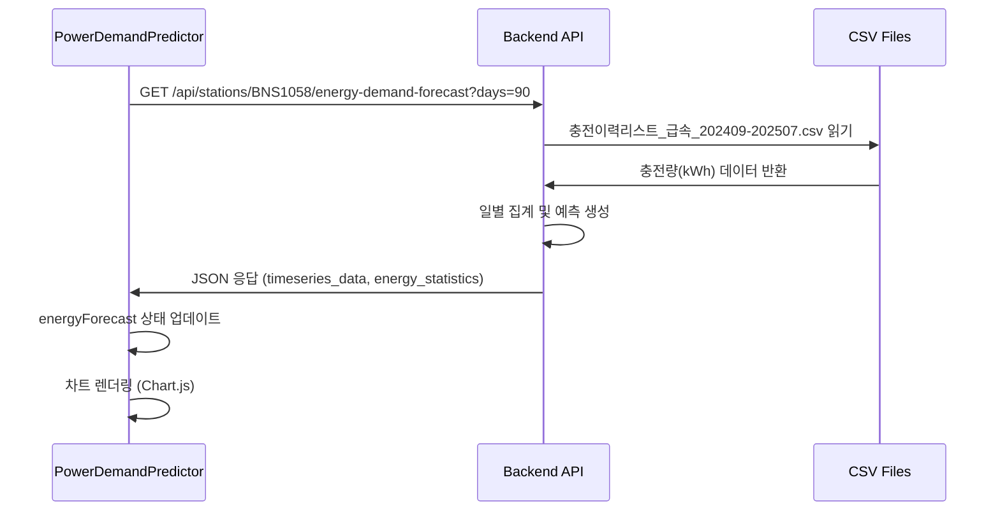
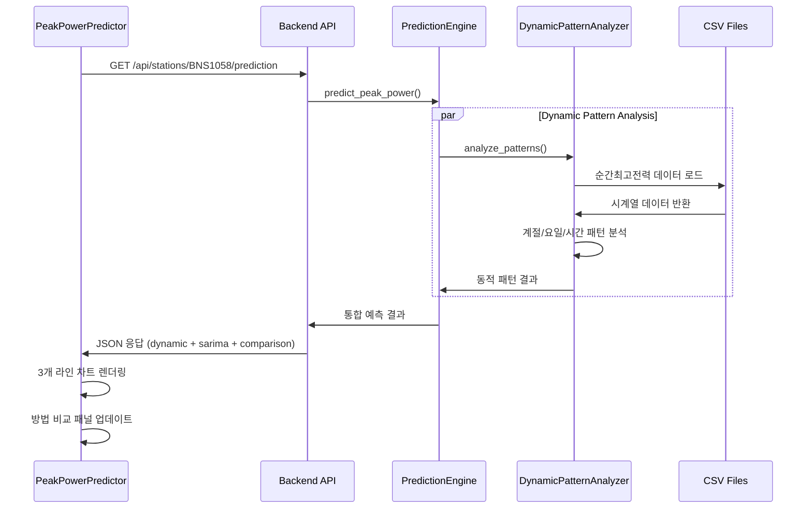

# API 문서 및 데이터 처리 흐름

## 📋 목차
- [API 엔드포인트 개요](#api-엔드포인트-개요)
- [전력량 수요 예측 API](#전력량-수요-예측-api)
- [최고전력 예측 API (Dynamic Pattern + SARIMA)](#최고전력-예측-api-dynamic-pattern--sarima)
- [월별 계약전력 추천 API](#월별-계약전력-추천-api)
- [충전소 목록 API](#충전소-목록-api)
- [환경변수 기반 설정](#환경변수-기반-설정)
- [데이터 처리 흐름](#데이터-처리-흐름)
- [프론트엔드-백엔드 연동](#프론트엔드-백엔드-연동)

## 🚀 API 엔드포인트 개요

| 엔드포인트 | 메서드 | 설명 | 사용 위치 |
|-----------|--------|------|-----------|
| `/api/stations` | GET | 충전소 목록 조회 | 메인 페이지 |
| `/api/stations/{station_id}/energy-demand-forecast` | GET | 전력량 수요 예측 | PowerDemandPredictor |
| `/api/stations/{station_id}/prediction` | GET | **동적 패턴 + SARIMA** 최고전력 예측 비교 | PeakPowerPredictor |
| `/api/stations/{station_id}/monthly-contract` | GET | 월별 계약전력 추천 | MonthlyChart |
| `/api/stations/{station_id}/timeseries` | GET | 시계열 데이터 조회 | 차트 컴포넌트 |
| `/api/data-range/{station_id}` | GET | 데이터 범위 확인 | 데이터 검증 |
| `/api/admin/upload-csv` | POST | CSV 파일 업로드 | 관리자 도구 |
| `/health` | GET | 시스템 상태 확인 | 헬스체크 |

## ⚡ 전력량 수요 예측 API

### 1. API 요청
```javascript
// 프론트엔드 (PowerDemandPredictor.svelte)
const url = `/api/stations/${stationId}/energy-demand-forecast?days=${days}`;
const response = await fetch(url, {
    cache: "no-cache",
    signal: AbortSignal.timeout(15000)
});
```

**요청 파라미터:**
- `station_id`: 충전소 ID (예: BNS1058)
- `days`: 데이터 조회 기간 (30, 90, 180, 365일)

### 2. 백엔드 처리 과정

#### 2.1 API 라우트 처리
```python
# backend/app/api/routes.py
@api_router.get("/stations/{station_id}/energy-demand-forecast")
async def get_energy_demand_forecast(station_id: str, days: int = 90):
    station_service = get_station_service()
    return station_service.get_energy_demand_forecast(station_id, days)
```

#### 2.2 서비스 레이어 처리
```python
# backend/app/services/station_service.py
def get_energy_demand_forecast(self, station_id: str, days: int = 90):
    # 1. 캐시 확인
    cache_key = f"energy_demand_{station_id}_{days}"
    cached_result = self._get_cache(cache_key, use_long_cache=True)
    
    # 2. CSV 데이터 로드
    loader = ChargingDataLoader(station_id)
    df = loader.load_historical_sessions(days=365)  # 1년 데이터로 제한
    
    # 3. 에너지 컬럼 찾기
    energy_cols = [col for col in df.columns 
                   if any(keyword in col.lower() 
                   for keyword in ["에너지", "energy", "kwh", "충전량", "kWh"])]
    
    # 4. 데이터 집계 및 예측
    result = self._generate_energy_forecast(daily_energy, energy_col, station_id)
```

#### 2.3 데이터 로더
```python
# backend/app/data/loader.py
class ChargingDataLoader:
    def load_historical_sessions(self, days: int = 90):
        # CSV 파일에서 데이터 로드
        # "충전량(kWh)", "충전시작일시", "충전종료일시" 등 속성 불러오기
```

### 3. API 응답 구조
```json
{
  "success": true,
  "energy_statistics": {
    "total_energy": 33311.39,
    "avg_daily": 594.85,
    "min_daily": 176.02,
    "max_daily": 1057.37,
    "std_daily": 210.13
  },
  "timeseries_data": [
    {
      "date": "2025-06-06",
      "energy": 573.75,
      "type": "actual"
    },
    {
      "date": "2025-08-01",
      "energy": 415.01,
      "type": "predicted"
    }
  ],
  "monthly_summary": [...],
  "growth_rate": 0.0,
  "data_range": {
    "start_date": "2025-06-06",
    "end_date": "2025-07-31"
  },
  "insights": [...],
  "station_id": "BNS1058",
  "station_name": "서울 흑석운수"
}
```

## ⚡ 최고전력 예측 API

### 1. API 요청
```javascript
// 프론트엔드 (PeakPowerPredictor.svelte)
const url = `/api/stations/${stationId}/prediction`;
const response = await fetch(url, {
    cache: "no-cache",
    signal: AbortSignal.timeout(15000)
});
```

**요청 파라미터:**
- `station_id`: 충전소 ID (예: BNS1058)

### 2. 백엔드 처리 과정

#### 2.1 API 라우트 처리
```python
# backend/app/api/routes.py
@api_router.get("/stations/{station_id}/prediction")
async def get_peak_power_prediction(station_id: str):
    station_service = get_station_service()
    return station_service.get_peak_power_prediction(station_id)
```

#### 2.2 예측 엔진 처리
```python
# backend/app/services/station_service.py
def get_peak_power_prediction(self, station_id: str):
    # 1. 캐시 확인
    cache_key = f"peak_prediction_{station_id}"
    cached_result = self._get_cache(cache_key)
    
    # 2. 동적 패턴 예측 실행
    from app.prediction.engine import PredictionEngine
    engine = PredictionEngine()
    
    # 3. Dynamic Pattern 분석
    dynamic_result = engine.predict_peak_power(station_id)
    
    # 4. SARIMA 예측 병렬 실행
    sarima_result = engine.predict_with_sarima(station_id)
    
    # 5. 결과 통합 및 비교 데이터 생성
    return self._combine_prediction_results(dynamic_result, sarima_result)
```

#### 2.3 동적 패턴 분석
```python
# backend/app/prediction/dynamic_patterns.py
class DynamicPatternAnalyzer:
    def analyze_patterns(self, df, station_id):
        # 1. 계절적 패턴 분석 (적응형)
        seasonal_factors = self._calculate_adaptive_seasonal_factors(df)
        
        # 2. 요일별 패턴 분석
        weekly_factors = self._calculate_weekly_patterns(df)
        
        # 3. 시간대별 패턴 분석
        hourly_factors = self._calculate_hourly_patterns(df)
        
        # 4. 신뢰도 기반 가중치 계산
        confidence = self._calculate_pattern_confidence(df)
        
        return {
            "seasonal_factors": seasonal_factors,
            "weekly_factors": weekly_factors,
            "hourly_factors": hourly_factors,
            "confidence": confidence
        }
```

#### 2.4 SARIMA 예측
```python
# backend/app/prediction/sarima_model.py
class SARIMAPredictor:
    def predict(self, station_id: str):
        # 1. 시계열 데이터 준비
        timeseries_data = self._prepare_timeseries_data(station_id)
        
        # 2. SARIMA 모델 피팅
        model = SARIMAX(timeseries_data, order=(1,1,1), seasonal_order=(1,1,1,12))
        fitted_model = model.fit(disp=False)
        
        # 3. 6개월 예측
        forecast = fitted_model.forecast(steps=6)
        confidence_intervals = fitted_model.get_forecast(steps=6).conf_int()
        
        return SARIMAResult(forecast, confidence_intervals)
```

### 3. API 응답 구조
```json
{
  "success": true,
  "predicted_peak": 87.5,
  "recommended_contract_kw": 100.0,
  "station_info": {
    "station_id": "BNS1058",
    "station_name": "서울 흑석운수",
    "location": "서울특별시 동작구"
  },
  
  // Dynamic Pattern 예측 결과
  "dynamic_prediction": {
    "raw_prediction": 94.8,
    "adjusted_prediction": 87.5,
    "confidence": 0.85,
    "applied_adjustments": true,
    "patterns_used": {
      "seasonal_factor": 1.1,
      "weekly_factor": 0.95,
      "hourly_factor": 1.05
    }
  },
  
  // SARIMA 예측 결과
  "sarima_prediction": {
    "predicted_value": 82.3,
    "confidence": 0.78,
    "success": true,
    "error_message": null,
    "forecast_data": [
      {
        "date": "2025-10",
        "value": 82.3,
        "confidence_lower": 74.1,
        "confidence_upper": 90.5
      }
    ]
  },
  
  // 예측 방법 비교
  "method_comparison": {
    "dynamic_patterns": {
      "predicted_value": 87,
      "confidence": 0.85,
      "strengths": ["실시간 적응", "패턴 변화 반영"],
      "weaknesses": ["단기 변동성"]
    },
    "sarima": {
      "predicted_value": 82,
      "confidence": 0.78,
      "strengths": ["시계열 안정성", "장기 추세"],
      "weaknesses": ["패턴 변화 지연"]
    }
  },
  
  // 차트용 시계열 데이터
  "timeseries_data": [
    {
      "date": "2025-06-06",
      "actual": 94.2,
      "type": "historical"
    },
    {
      "date": "2025-08-15",
      "dynamic_prediction": 87.5,
      "sarima_prediction": 82.3,
      "type": "forecast"
    }
  ]
}
```

### 4. 프론트엔드 차트 통합
```javascript
// Chart.js 데이터셋 구성
const chartData = {
  datasets: [
    {
      label: "실제 데이터",
      data: actualData,
      borderColor: "#10b981",
      backgroundColor: "transparent",
      fill: false
    },
    {
      label: "Dynamic Pattern 예측",
      data: dynamicPredictionData,
      borderColor: "#3b82f6",
      borderDash: [5, 5],
      backgroundColor: "transparent",
      fill: false
    },
    {
      label: "SARIMA 예측",
      data: sarimaPredictionData,
      borderColor: "#f59e0b",
      borderDash: [10, 5],
      backgroundColor: "transparent", 
      fill: false
    }
  ]
};
```

## 📊 월별 계약전력 추천 API

### 1. API 요청
```javascript
// 프론트엔드 (MonthlyChart.svelte)
const url = `/api/stations/${stationId}/monthly-contract`;
const response = await fetch(url);
```

### 2. API 응답 구조
```json
{
  "success": true,
  "monthly_data": [
    {
      "month": "2025-01",
      "recommended_contract_kw": 95.0,
      "predicted_peak": 87.2,
      "safety_margin": 8.0,
      "confidence": 0.82
    }
  ],
  "year_summary": {
    "avg_recommended": 92.5,
    "min_contract": 85.0,
    "max_contract": 105.0,
    "total_cost_savings": 150000
  }
}
```

## 🏢 충전소 목록 API

### 1. API 요청
```javascript
// 프론트엔드 (stationStore.ts)
const response = await apiService.getStations({
    limit: 9999,
    search: search,
    sortBy: sortBy,
    sortOrder: sortOrder
});
```

### 2. 백엔드 처리
```python
# backend/app/services/station_service.py
def list_stations(self, search: str = None, sort_by: str = "id", sort_order: str = "asc"):
    # 1. 캐시 확인 (1시간 캐시)
    cache_key = f"stations_{search}_{sort_by}_{sort_order}"
    cached_result = self._get_cache(cache_key, use_long_cache=True)
    
    # 2. CSV 파일에서 전체 데이터 로드
    loader = ChargingDataLoader("ALL")
    df = loader.load_historical_sessions(days=365)
    
    # 3. 충전소별 집계 데이터 생성
    stations = self._process_station_list(df, search, sort_by, sort_order)
```

## ⚙️ 환경변수 기반 설정

### 1. 서버 설정 환경변수

시스템은 환경변수를 통한 동적 설정을 지원합니다:

```bash
# 개발 환경 (.env)
ENVIRONMENT=development
BACKEND_HOST=127.0.0.1
BACKEND_PORT=8000
BACKEND_URL=http://127.0.0.1:8000

FRONTEND_HOST=localhost
FRONTEND_PORT=5173
FRONTEND_URL=http://localhost:5173

# 프로덕션 환경 (.env.production)
ENVIRONMENT=production
PRODUCTION_IP=220.69.200.55
PRODUCTION_BACKEND_URL=http://220.69.200.55:32375
PRODUCTION_FRONTEND_URL=http://220.69.200.55:32376
```

### 2. 설정 로더
```python
# backend/app/core/config.py
class Settings(BaseSettings):
    # 서버 설정
    backend_host: str = "0.0.0.0"
    backend_port: int = 8000  # 개발용 기본값
    backend_url: str = "http://127.0.0.1:8000"
    
    # 프론트엔드 설정  
    frontend_host: str = "localhost"
    frontend_port: int = 5173  # Vite 기본값
    frontend_url: str = "http://localhost:5173"
    
    # 프로덕션 설정
    production_ip: Optional[str] = "220.69.200.55"
    production_backend_url: Optional[str] = "http://220.69.200.55:32375"
    production_frontend_url: Optional[str] = "http://220.69.200.55:32376"
    
    model_config = {
        "env_file": ".env",
        "env_file_encoding": "utf-8"
    }

# 전역 설정 인스턴스
settings = Settings()
```

### 3. 프론트엔드 환경변수
```bash
# frontend/.env
VITE_ENVIRONMENT=development
VITE_BACKEND_URL=http://127.0.0.1:8000
VITE_PRODUCTION_BACKEND_URL=http://220.69.200.55:32375
VITE_API_TIMEOUT=15000

FRONTEND_HOST=localhost
FRONTEND_PORT=5173
FRONTEND_URL=http://localhost:5173
```

### 4. 환경별 서버 실행

#### 개발 환경
```bash
# 백엔드 (포트 8000)
cd backend && python -m uvicorn app.main:app --host 0.0.0.0 --port 8000 --reload

# 프론트엔드 (포트 5173)
cd frontend && npm run dev
```

#### 프로덕션 환경
```bash
# 백엔드 (포트 32375)
cd backend && python -m uvicorn app.main:app --host 0.0.0.0 --port 32375 --workers 4

# 프론트엔드 빌드 및 실행 (포트 32376)  
cd frontend && npm run build && npm run preview
```

### 5. CORS 설정 자동화
```python
# 환경변수 기반 CORS 자동 설정
allowed_origins: str = "http://localhost:3000,http://localhost:5173,http://localhost:5174,http://127.0.0.1:5173,http://127.0.0.1:5174,http://localhost:32376,http://localhost:32377,http://220.69.200.55:32376"

@property
def cors_origins(self) -> List[str]:
    """CORS origins as list"""
    return [origin.strip() for origin in self.allowed_origins.split(",")]
```

## 🔄 데이터 처리 흐름

### 1. CSV 데이터 구조
```csv
권역,시군구,충전소ID,충전소명,충전소주소,...,충전량(kWh),순간최고전력
서울특별시,동작구,BNS1058,서울 흑석운수,...,201.17,97.16
```

### 2. 데이터 변환 과정
```python
# 1. CSV 로드 및 필터링
df = pd.read_csv(csv_file)
df_station = df[df['충전소ID'] == station_id]

# 2. 에너지 데이터 집계 (일별)
daily_energy = df_clean.groupby("date")["충전량(kWh)"].sum()

# 3. 통계 계산
energy_stats = {
    "total_energy": daily_energy.sum(),
    "avg_daily": daily_energy.mean(),
    "min_daily": daily_energy.min(),
    "max_daily": daily_energy.max()
}

# 4. 예측 데이터 생성 (향후 30일)
for i in range(1, 31):
    future_date = last_date + pd.Timedelta(days=i)
    seasonal_factor = calculate_seasonal_factor(future_date.month)
    weekly_factor = calculate_weekly_factor(future_date.weekday())
    predicted_energy = avg_energy * seasonal_factor * weekly_factor
```

## 🎯 프론트엔드-백엔드 연동

### 1. PowerDemandPredictor 컴포넌트 흐름 (전력량 예측)



### 2. PeakPowerPredictor 컴포넌트 흐름 (최고전력 예측)



### 3. 데이터 바인딩

#### PowerDemandPredictor (전력량 예측)
```javascript
// 1. API 응답을 내부 상태로 변환
energyForecast = {
    daily_consumption: result.timeseries_data,    // 차트 데이터
    energy_statistics: result.energy_statistics,  // 통계 정보
    monthly_summary: result.monthly_summary,      // 월별 요약
    insights: result.insights,                    // 인사이트
    growth_rate: result.growth_rate              // 성장률
};

// 2. 기간별 전력량 예측 계산
$: predictedEnergyDemand = (() => {
    const avgDaily = energyForecast.energy_statistics.avg_daily;
    const periodMultiplier = forecastPeriods.find(p => p.value === energyForecastPeriod).multiplier;
    return avgDaily * periodMultiplier * seasonalFactor;
})();

// 3. 차트 데이터 준비
const actualData = daily_consumption.filter(item => item.type === 'actual');
const predictedData = daily_consumption.filter(item => item.type === 'predicted');
```

#### PeakPowerPredictor (최고전력 예측)
```javascript
// 1. API 응답 처리
peakPrediction = {
    predicted_peak: result.predicted_peak,
    recommended_contract_kw: result.recommended_contract_kw,
    dynamic_prediction: result.dynamic_prediction,
    sarima_prediction: result.sarima_prediction,
    method_comparison: result.method_comparison,
    timeseries_data: result.timeseries_data
};

// 2. 차트 데이터 준비 (3개 라인)
$: chartData = {
    datasets: [
        {
            label: "실제 데이터",
            data: timeseries_data.filter(item => item.type === 'historical'),
            borderColor: "#10b981"
        },
        {
            label: "Dynamic Pattern 예측",
            data: timeseries_data.filter(item => item.dynamic_prediction),
            borderColor: "#3b82f6",
            borderDash: [5, 5]
        },
        {
            label: "SARIMA 예측", 
            data: timeseries_data.filter(item => item.sarima_prediction),
            borderColor: "#f59e0b",
            borderDash: [10, 5]
        }
    ]
};

// 3. 방법 비교 데이터
$: methodComparison = peakPrediction?.method_comparison;
```

## 🚀 성능 최적화

### 1. 캐시 전략
- **충전소 목록**: 1시간 캐시 (정적 데이터)
- **에너지 예측**: 30분 캐시 (동적 데이터)
- **Chart.js 모듈**: 브라우저 세션 캐시

### 2. 데이터 제한
- CSV 로드: 전체 데이터 → 1년 데이터 (365일)
- API 응답: 압축된 JSON 형식
- 차트 렌더링: 동적 임포트 및 미리 로드

### 3. 에러 처리
```python
# 백엔드
try:
    energy_cols = find_energy_columns(df)
    if not energy_cols:
        return {"success": False, "message": "에너지 데이터 컬럼을 찾을 수 없습니다."}
except Exception as e:
    return {"success": False, "error": str(e)}
```

```javascript
// 프론트엔드
try {
    const result = await response.json();
    if (result.success && result.timeseries_data) {
        // 성공 처리
    } else {
        throw new Error(result.error || "에너지 예측 실패");
    }
} catch (error) {
    console.error('Energy forecast 데이터 로드 실패:', error);
    energyForecast = null;
}
```

---

## 📊 주요 데이터 흐름 요약

### 전력량 수요 예측 (PowerDemandPredictor)
1. **사용자 액션**: 충전소 선택 → `/dashboard/BNS1058` 접속
2. **API 호출**: `GET /api/stations/BNS1058/energy-demand-forecast?days=90`
3. **데이터 로드**: CSV에서 해당 충전소의 `충전량(kWh)` 데이터 추출
4. **데이터 처리**: 일별 집계 → 통계 계산 → 향후 30일 예측 생성
5. **응답 반환**: JSON 형태로 프론트엔드에 전달
6. **UI 렌더링**: Chart.js로 시각화 + 메트릭 카드 업데이트
7. **사용자 인터랙션**: 기간 변경 시 클라이언트 사이드에서 재계산

### 최고전력 예측 (PeakPowerPredictor)
1. **사용자 액션**: 충전소 선택 → Peak Power Predictor 탭
2. **API 호출**: `GET /api/stations/BNS1058/prediction`
3. **병렬 처리**:
   - **Dynamic Pattern**: 적응형 계절/요일/시간 패턴 분석
   - **SARIMA**: 시계열 자동회귀 모델 예측
4. **결과 통합**: 두 방법의 예측값과 신뢰도 비교
5. **응답 반환**: 통합된 JSON (dynamic + sarima + comparison)
6. **UI 렌더링**: 3개 라인 차트 + 방법 비교 패널
7. **계약전력 추천**: 안전 마진 포함한 최적 계약전력 제시

## 🏆 시스템 주요 특징 (v0.0.4)

### 1. 🎯 Dynamic Pattern 기반 예측
- **적응형 패턴 분석**: 정적 요인 대신 데이터에서 실시간 패턴 추출
- **신뢰도 기반 조정**: 데이터 품질에 따른 가중치 적용
- **충전소별 특화**: 각 충전소의 고유 사용 패턴 자동 반영

### 2. 🔄 SARIMA 시계열 예측
- **자동회귀 모델**: SARIMA(1,1,1)(1,1,1,12) 모델 사용
- **6개월 장기 예측**: 시계열 기반 안정적 예측
- **신뢰구간 제공**: 상하한 신뢰구간으로 불확실성 표시

### 3. 📊 이중 예측 시스템  
- **방법 비교**: Dynamic Pattern vs SARIMA 동시 비교
- **3-라인 차트**: 실제/Dynamic/SARIMA 데이터 시각화
- **신뢰도 점수**: 각 예측 방법의 신뢰도 제공

### 4. 🌐 환경변수 기반 설정
- **개발/프로덕션 분리**: 포트 및 URL 환경별 자동 설정
- **보안 강화**: 민감한 정보 환경변수로 관리
- **Pydantic 설정**: 타입 안전한 설정 관리

### 5. ⚡ 성능 최적화
- **멀티레벨 캐싱**: 충전소 목록(1시간), 예측 결과(30분)
- **병렬 처리**: Dynamic Pattern과 SARIMA 동시 실행
- **데이터 제한**: 365일 데이터로 메모리 사용량 최적화

### 6. 🔧 개발자 도구
- **통합 디버그 도구**: `debug_consolidated.py`로 시스템 진단
- **API 문서**: Swagger UI 자동 생성
- **타입 힌트**: Python과 TypeScript 전반에 타입 안전성

### 7. 📈 비즈니스 가치
- **계약전력 최적화**: 안전 마진 포함 최적 계약전력 추천
- **비용 절감**: 과도한 계약전력 방지로 전력 요금 절약
- **의사결정 지원**: 신뢰도 기반 예측으로 합리적 판단 지원

이 문서는 개발팀이 API 구조와 데이터 흐름을 이해하고 유지보수하는 데 도움이 될 것입니다.