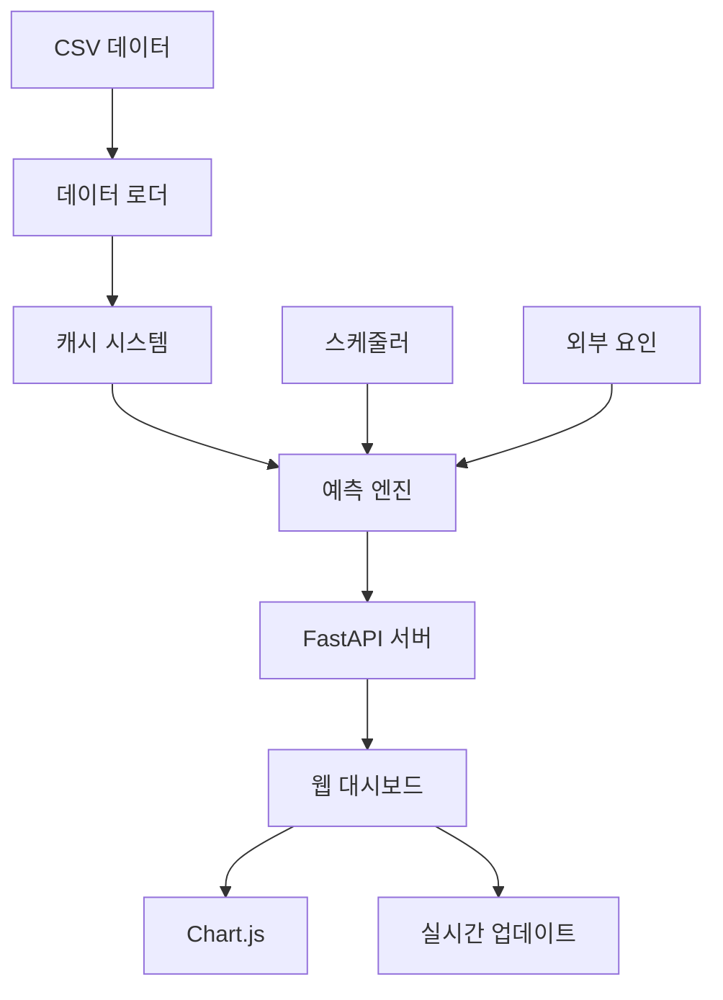

# ⚡ 충전소 전력 수요 예측 시스템

<div align="center">


<!--  -->

**CSV 데이터 기반 실시간 전력 수요 예측 및 계약 최적화 솔루션**

</div>

## 🎯 프로젝트 개요

100kW 급속충전소의 전력 수요를 예측하고 최적의 전력 계약을 제안하는 지능형 시스템입니다. CSV 데이터 분석을 통해 실시간 예측과 시각화를 제공합니다.

## ✨ 주요 기능

### 🔮 전력 예측
- **실시간 순간최고전력 예측**: 다음 1시간 내 예상 최고 전력
- **계절성 반영**: 월별 패턴 분석을 통한 장기 예측
- **SOC 기반 분석**: 배터리 상태와 전력 소비의 상관관계 분석

### 📊 데이터 시각화
  - 시간대별 전력 패턴 (24시간)
  - 전력 분포 도넛 차트
  - 월별 예측 트렌드
  - SOC vs 전력 산점도

### 🏢 충전소 관리
- **동적으로 충전소 관리하기** : 충전소 정보 추출
- **멀티 스테이션 지원** : 여러 충전소 통합 관리
- **상태 모니터링** : 충전소별 운영 상태 실시간 확인

### 💰 계약 최적화
- **월별 계약 권고** : 데이터 기반 최적 계약 전력 제안
- **계절성 조정** : 월별 전력 수요 변화 반영
- **비용 절감** : 과도한 계약 전력으로 인한 낭비 방지

## 🛠️ 기술 스택

### Backend
- **FastAPI**: 고성능 비동기 웹 프레임워크
- **Python 3.8+**: 데이터 분석 및 머신러닝
- **Pandas**: 데이터 처리 및 분석
- **NumPy**: 수치 계산
- **Uvicorn**: ASGI 서버

### Frontend
- **HTML5 + CSS3**: 반응형 웹 디자인
- **JavaScript (ES6+)**: 모던 클라이언트 사이드 로직
- **Chart.js 3.9+**: 인터랙티브 차트 라이브러리

### 데이터
- **CSV 기반**: 충전 세션 데이터 분석
- **실시간 캐싱**: 성능 최적화된 데이터 로딩
- **동적 스키마**: 다양한 CSV 형식 지원

## 🚀 빠른 시작

### 1. 환경 설정

```bash
# 저장소 클론
git clone https://github.com/dongbab/charging_station_peak_predictor.git
cd charging_station_peak_predictor

# 가상환경 생성 및 활성화
python -m venv venv
source venv/bin/activate  # Windows: venv\Scripts\activate

# 의존성 설치
pip install -r requirements.txt
```

### 2. 데이터 준비

```bash
mkdir -p data
# csv 파일을 data/ 폴더 내 복사 필요
```

**CSV 파일 형식 예시:**
```csv
충전소ID,충전소명,충전소주소,충전시작일시,충전종료일시,순간최고전력(kW),시작SOC(%),종료SOC(%),충전기 구분,커넥터명
BNS0001,강남충전소,서울시 강남구...,2024-01-01 09:00:00,2024-01-01 09:30:00,85.5,20,80,100kW급속,DC콤보
```

### 3. 서버 실행

```bash
# 개발 서버 실행
python main.py

# 또는 직접 uvicorn 실행
uvicorn main:app --host 0.0.0.0 --port 8000 --reload
```

### 4. 웹 접속

```
🌐 메인 페이지: http://localhost:8000
🏢 충전소 선택: http://localhost:8000/station-selector
📊 API 문서: http://localhost:8000/api/docs
```

## 📁 프로젝트 구조

```
ev-charging-predictor/
├── 📄 main.py                 # FastAPI 메인 애플리케이션
├── 📁 prediction/             # 예측 엔진
│   ├── predictor.py          # 실시간 예측 로직
│   └── scheduler.py          # 스케줄링 시스템
├── 📁 data/                   # 데이터 폴더
│   ├── loader.py             # 데이터 로더
│   └── *.csv                 # 충전 세션 데이터
├── 📁 utils/                  # 유틸리티
│   ├── config.py             # 설정 관리
│   └── logger.py             # 로깅 시스템
├── 📁 templates/              # HTML 템플릿
│   ├── dashboard.html        # 대시보드 페이지
│   └── station_selector.html # 충전소 선택 페이지
├── 📁 static/                 # 정적 파일
│   ├── 📁 css/
│   │   └── dashboard.css     # 스타일시트
│   └── 📁 js/
│       └── dashboard.js      # 프론트엔드 로직
├── 📁 logs/                   # 로그 파일
├── 📄 requirements.txt        # Python 의존성
└── 📄 README.md              # 이 문서
```

## 🔧 설정 가이드

### 환경 변수 설정

```bash
# .env 파일 생성 (선택사항)
API_HOST=0.0.0.0
API_PORT=8000
API_WORKERS=1
LOG_LEVEL=INFO
CACHE_EXPIRE_MINUTES=10
```

### config.py 커스터마이징

```python
class PredictionConfig:
    # 서버 설정
    api_host: str = "0.0.0.0"
    api_port: int = 8000
    api_workers: int = 1
    
    # 캐시 설정
    cache_expire_minutes: int = 10
    
    # 데이터 설정
    data_folder: str = "data"
    max_sessions: int = 10000
```

## 📊 대시보드 사용법

### 🎮 키보드 단축키

| 단축키 | 기능 |
|--------|------|
| `Ctrl + R` | 대시보드 새로고침 |
| `Ctrl + E` | 데이터 내보내기 |
| `Ctrl + 1` | 실시간 예측 |
| `Ctrl + 2` | 상세 분석 |
| `Ctrl + 3` | 월별 계약 권고 |
| `Ctrl + H` | 키보드 단축키 도움말 |
| `ESC` | 결과 패널 닫기 |

### 📈 차트 해석

#### 1. 시간대별 전력 패턴
- **X축**: 시간 (0시~23시)
- **Y축**: 평균 전력 (kW)
- **활용**: 피크 시간대 파악, 운영 계획 수립

#### 2. 전력 분포
- **낮은 전력 (0-30kW)**: 완속 충전 또는 충전 완료 단계
- **중간 전력 (30-60kW)**: 일반적인 급속 충전
- **높은 전력 (60-100kW)**: 최고 성능 충전

#### 3. 월별 예측 트렌드
- **계절성 반영**: 겨울철 높은 전력 수요
- **X축**: 월 (1월~12월)
- **Y축**: 예상 최고전력 (kW)

#### 4. SOC vs 전력 관계
- **X축**: 시작 SOC (%)
- **Y축**: 순간최고전력 (kW)
- **패턴**: SOC가 낮을수록 높은 전력으로 충전

### 🔄 자동 새로고침
- **간격**: 5분마다 자동 실행
- **조건**: 페이지 활성화 상태일 때만
- **네트워크**: 연결 상태 자동 감지

## 🔍 API 문서

### 📋 주요 엔드포인트

#### 1. 충전소 목록
```http
GET /api/stations
```

**응답 예시:**
```json
{
  "stations": [
    {
      "id": "BNS0001",
      "name": "강남충전소",
      "location": "서울시 강남구...",
      "charger_type": "100kW 급속충전기",
      "status": "정상 운영",
      "data_sessions": 1234,
      "utilization": "67.8%"
    }
  ],
  "total": 15,
  "active": 12
}
```

#### 2. 실시간 예측
```http
GET /predict/{station_id}
```

**응답 예시:**
```json
{
  "station_id": "BNS0001",
  "predicted_peak": 78.5,
  "confidence": 0.85,
  "timestamp": "2024-01-15T14:30:00",
  "method": "ml_ensemble"
}
```

#### 3. 월별 계약 권고
```http
GET /api/monthly-contract/{station_id}?year=2024&month=1
```

**응답 예시:**
```json
{
  "station_id": "BNS0001",
  "year": 2024,
  "month": 1,
  "predicted_peak_kw": 82.3,
  "recommended_contract_kw": 95,
  "seasonal_factor": 1.20
}
```

#### 4. 상세 분석
```http
GET /api/station-analysis/{station_id}
```

**응답 예시:**
```json
{
  "station_id": "BNS0001",
  "performance_analysis": {
    "utilization_rate": 67.8,
    "average_session_power": 65.2,
    "maximum_recorded_power": 98.7,
    "efficiency_grade": "A"
  },
  "charts_data": {
    "hourly_pattern": [5, 8, 12, ...],
    "monthly_predictions": {...}
  }
}
```

### 🔧 관리 API

#### 캐시 새로고침
```http
POST /api/admin/refresh-cache
```

#### 헬스 체크
```http
GET /health
```

## 💡 주요 특징

### 🚀 성능 최적화
- **인메모리 캐싱**: 10분간 충전소 정보 캐시
- **비동기 처리**: FastAPI 기반 고성능 API
- **지연 로딩**: 필요시에만 데이터 로드
- **요청 타임아웃**: 10-20초 제한으로 안정성 확보

### 🛡️ 안정성
- **네트워크 상태 감지**: 온라인/오프라인 자동 대응
- **에러 복구**: 개별 작업 실패가 전체에 영향 없음
- **데이터 검증**: API 응답 유효성 검사
- **우아한 실패 처리**: 사용자 친화적 오류 메시지

### 🎨 사용자 경험
- **반응형 디자인**: 모바일/태블릿/데스크톱 지원
- **애니메이션**: 부드러운 차트 전환과 숫자 증가 효과
- **접근성**: 키보드 네비게이션 완전 지원
- **다크 모드 준비**: CSS 변수 기반 테마 시스템

## 🎨 프론트엔드 기능

### ✨ 애니메이션 시스템
- **메트릭 카운터**: 숫자가 부드럽게 증가/감소
- **차트 전환**: easeOutQuart 이징으로 자연스러운 애니메이션
- **로딩 상태**: 스피너와 버튼 비활성화
- **상태 알림**: 슬라이드 인/아웃 효과

### 🎯 상호작용 기능
- **호버 효과**: 카드와 버튼에 미세한 변형
- **클릭 피드백**: 진동과 시각적 반응 (지원 기기)
- **스크롤 감지**: 차트 가시성에 따른 최적화
- **리사이즈 대응**: 창 크기 변경시 차트 자동 조정

### 📱 반응형 디자인
```css
/* 데스크톱 */
.charts-grid {
    grid-template-columns: 1fr 1fr;
    gap: 20px;
}

/* 태블릿 */
@media (max-width: 1200px) {
    .charts-grid {
        grid-template-columns: 1fr;
    }
}

/* 모바일 */
@media (max-width: 768px) {
    .metric-card:hover {
        transform: translateY(-4px) scale(1.01);
    }
}
```

### 🎨 CSS 개선사항
- **그라디언트 배경**: 모던한 시각적 효과
- **쉬머 효과**: 알림 메시지에 광택 애니메이션
- **커스텀 스크롤바**: 브라우저별 최적화
- **프린트 스타일**: 보고서 출력 최적화

## 📈 데이터 분석

### 📊 분석 지표

#### 전력 통계
- **평균 전력**: 충전 세션별 평균 소비 전력
- **최대 전력**: 기록된 순간최고전력
- **95% 백분위수**: 극값 제외한 실질적 최고 전력
- **이용률**: 100kW 대비 실제 사용률

#### 패턴 분석
- **시간대별 패턴**: 24시간 전력 사용 분포
- **요일별 패턴**: 주중/주말 차이 분석
- **계절성**: 월별 전력 수요 변화
- **SOC 상관관계**: 배터리 상태와 충전 전력의 관계

### 🔮 예측 알고리즘

#### 1. 통계적 기준선
```python
# 95% 백분위수 기반 예측
predicted_peak = statistics['percentile_95'] * seasonal_factor
```

#### 2. 시계열 분석
- **이동평균**: 최근 N일 평균
- **지수평활**: 최근 데이터에 더 높은 가중치
- **계절성 분해**: 트렌드와 계절성 분리

#### 3. 머신러닝 (향후 확장)
- **Random Forest**: 다중 변수 예측
- **LSTM**: 시계열 딥러닝
- **앙상블**: 여러 모델 결합

### 📋 데이터 품질 관리

#### 데이터 검증
```python
def validate_session_data(df):
    # 필수 컬럼 확인
    required_columns = ['충전소ID', '순간최고전력(kW)', '충전시작일시']
    
    # 데이터 타입 검증
    # 범위 검증 (0 < 전력 <= 100kW)
    # 날짜 형식 검증
```

#### 이상치 처리
- **전력 범위**: 0-100kW 범위 외 데이터 필터링
- **충전 시간**: 비정상적으로 짧거나 긴 세션 제외
- **SOC 범위**: 0-100% 범위 검증

## 🔄 시스템 아키텍처

### 🏗️ 전체 구조



### 🔄 데이터 플로우

1. **데이터 수집**: CSV 파일에서 충전 세션 데이터 로드
2. **전처리**: 데이터 정제 및 검증
3. **분석**: 통계 분석 및 패턴 추출
4. **예측**: 머신러닝 기반 전력 수요 예측
5. **시각화**: 웹 대시보드를 통한 결과 표시
6. **최적화**: 계약 전력 권고안 생성

### 🎯 모듈별 역할

#### 데이터 레이어
- **ChargingDataLoader**: CSV 데이터 로딩 및 전처리
- **캐싱 시스템**: 성능 최적화를 위한 인메모리 저장

#### 비즈니스 로직
- **RealTimePowerPredictor**: 실시간 전력 예측
- **PredictionScheduler**: 주기적 예측 작업 스케줄링

#### 프레젠테이션 레이어
- **FastAPI**: RESTful API 서버
- **Jinja2 템플릿**: 서버사이드 렌더링
- **JavaScript**: 클라이언트사이드 인터랙션

## 🐛 문제 해결

### ❗ 자주 발생하는 문제

#### 1. CSV 파일 인식 오류
**증상**: "충전소 데이터를 로드할 수 없습니다"
**해결책**:
```bash
# 1. CSV 파일 위치 확인
ls -la data/

# 2. CSV 파일 인코딩 확인 (UTF-8 권장)
file -i data/your_file.csv

# 3. 컬럼명 확인
head -1 data/your_file.csv
```

#### 2. 포트 충돌
**증상**: "Address already in use"
**해결책**:
```bash
# 포트 사용 확인
lsof -i :8000

# 다른 포트 사용
uvicorn main:app --port 8001
```

#### 3. 메모리 부족
**증상**: 대용량 CSV 처리 시 느린 성능
**해결책**:
```python
# config.py에서 세션 수 제한
max_sessions: int = 5000  # 기본값에서 줄이기
```

#### 4. 차트가 표시되지 않음
**해결책**:
1. 브라우저 콘솔 확인 (F12)
2. Chart.js CDN 연결 확인
3. 캐시 삭제 후 새로고침 (Ctrl+F5)

### 🔧 디버깅 가이드

#### 로그 확인
```bash
# 실시간 로그 확인
tail -f logs/main.log

# 에러만 필터링
grep ERROR logs/main.log
```

#### JavaScript 디버깅
```javascript
// 브라우저 콘솔에서 디버그 정보 확인
window.dashboardDebug.currentData()
window.dashboardDebug.charts()

// 네트워크 오류 시뮬레이션
window.dashboardDebug.simulateError('network')
```

#### API 테스트
```bash
# curl을 이용한 API 테스트
curl http://localhost:8000/api/stations
curl http://localhost:8000/predict/BNS0001
```

### 🛠️ 성능 최적화

#### 1. 캐시 설정 조정
```python
# 더 긴 캐시 시간 (메모리 사용량 증가)
CACHE_EXPIRE_MINUTES = 30
```